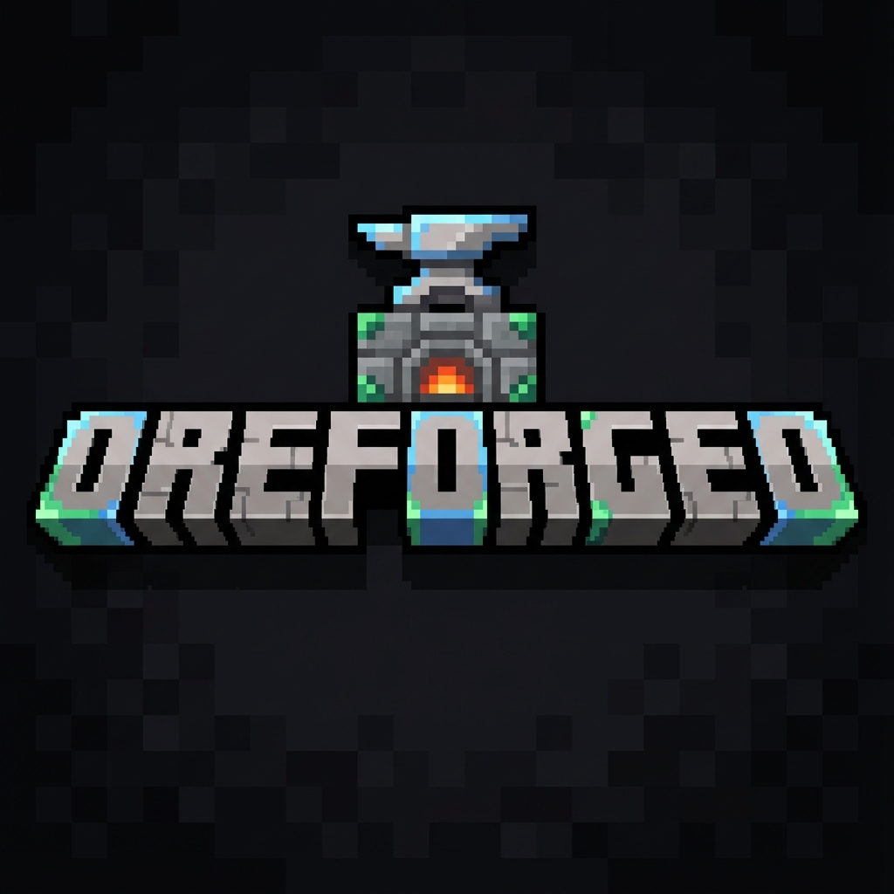
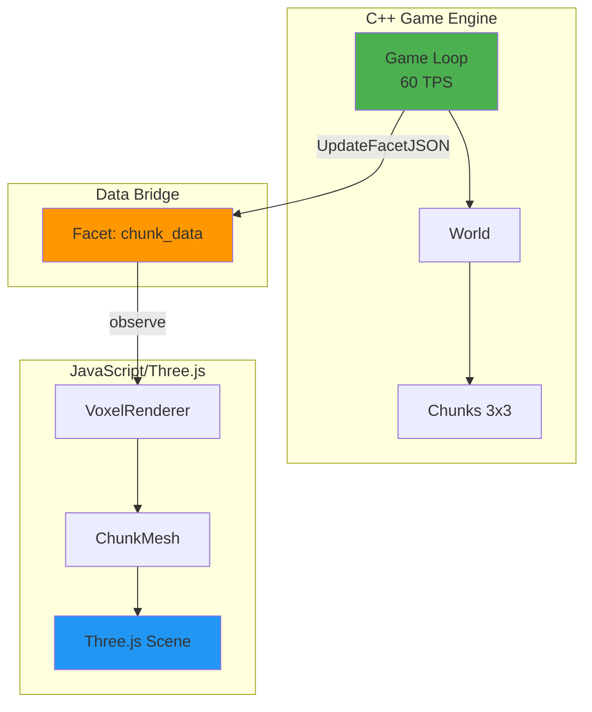
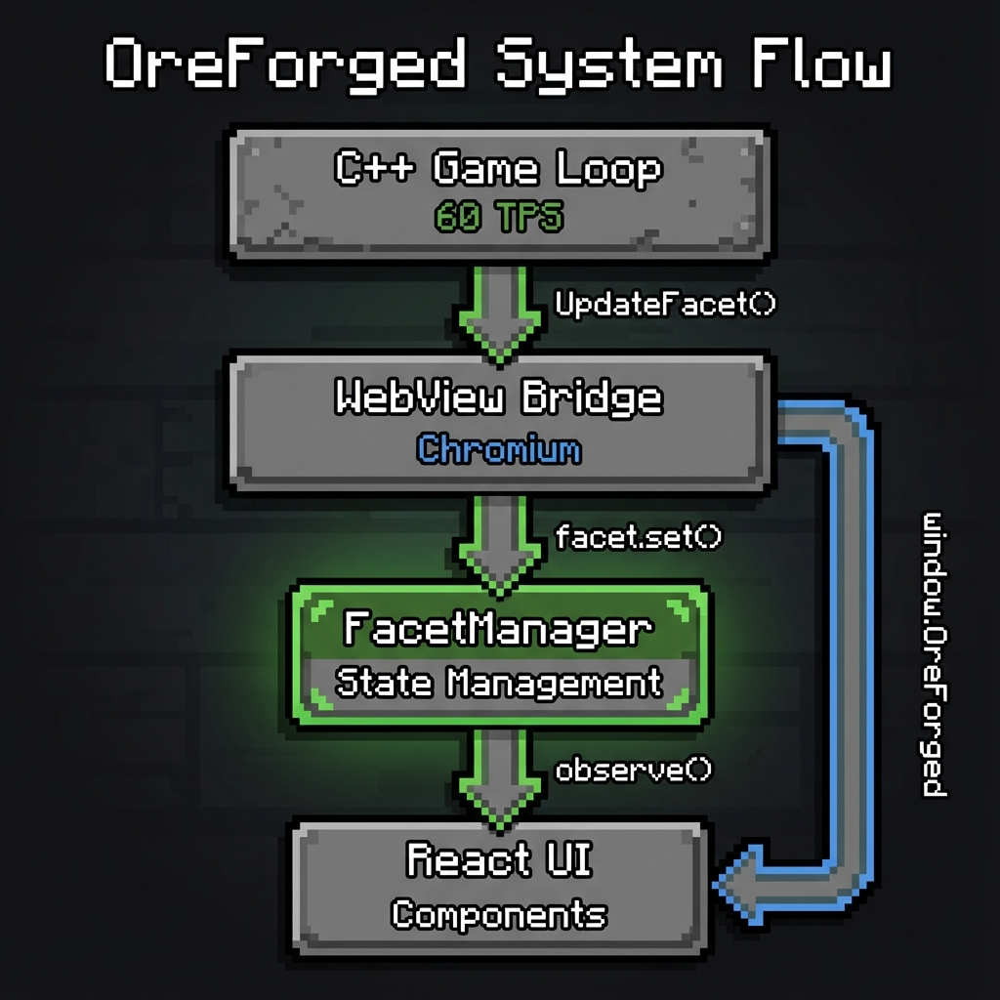
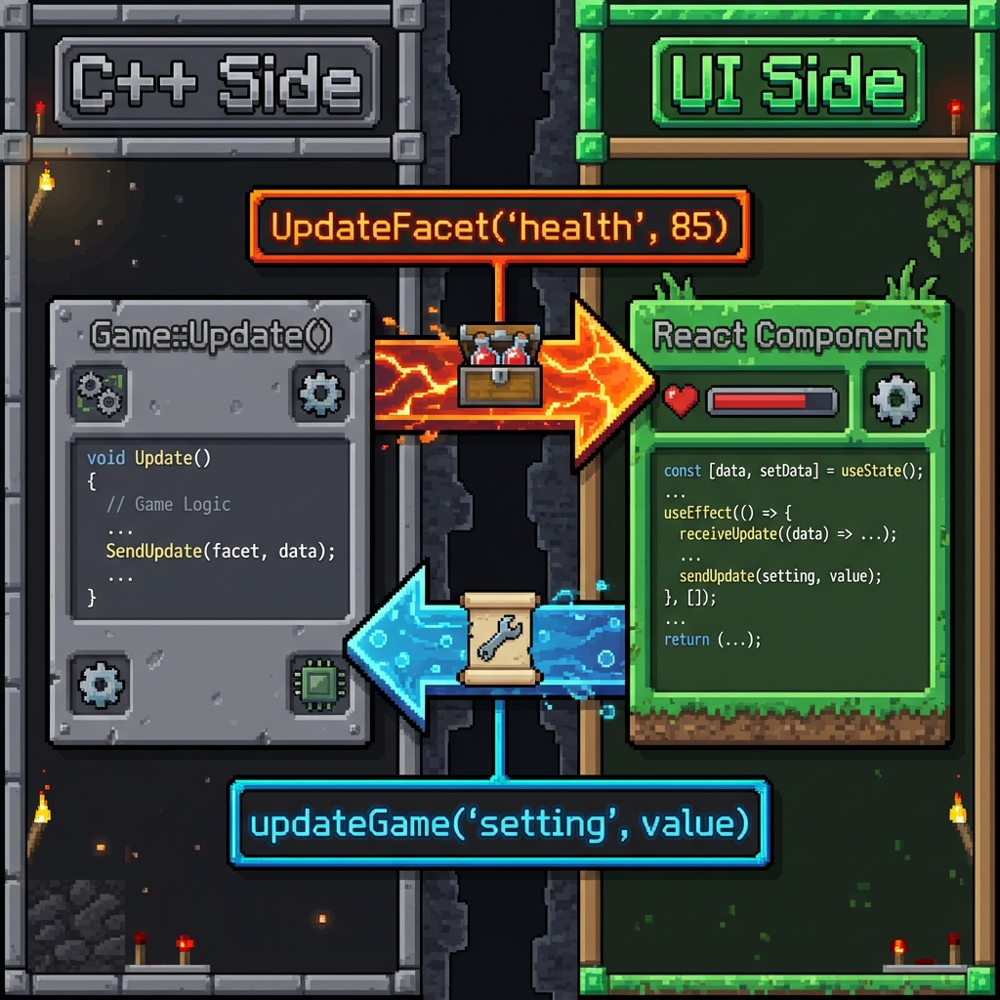

# OreForged

<p align="left">
  
</p>

> A game demo built in a custom engine. C++ handles game logic, React handles UI, and Three.js handles rendering.

[](https://opensource.org/licenses/MIT)

## 🎮 Download & Play

1. Go to the [**Releases Page**](https://github.com/seanbud/Oreforged/releases).
2. Download the latest `OreForged_Windows.zip`.
3. Extract the zip file.
4. Run `OreForged.exe`.

https://github.com/user-attachments/assets/7910a1c7-e497-4409-aded-b7dbaa2b23cd

https://github.com/user-attachments/assets/86ff46dd-155c-4097-b200-9c3648126003

## 🎯 Project Goals

**OreForged** is a "made from scratch" engine experiment exploring:

1. **Facet Pattern UI**: Implementing Mojang's data-driven UI architecture (as seen in Bedrock Edition).
2. **Decoupled Rendering**: A lightweight C++ game engine running separately from the visual layer.
3. **Simple Gameplay**: A focused "Collect → Upgrade → Repeat" loop to test the architecture.

<p align="left">
  
</p>

## ✨ Key Features

-   **Backend-Authoritative**: C++ owns all game logic, UI is a view layer
-   **Zero React Re-renders**: Direct DOM updates via Facets bypass React reconciliation
-   **60 TPS Game Loop**: Smooth C++ game logic running in parallel with UI
-   **Mojang-Inspired Facets**: Using the same open-source library pattern as Minecraft Bedrock
-   **Engine Demo & Fun Game**: A technical showcase that's actually fun to play!


## 🛠️ Development Setup

If you want to build the engine yourself or contribute code:

### Prerequisites

-   **C++**: CMake, MSVC (Windows) or GCC/Clang (Linux/Mac)
-   **Node.js**: v18+ with `pnpm` installed globally
-   **Git**: For cloning the repository

### Build & Run

```bash
# Clone the repository
git clone https://github.com/seanbud/Oreforged.git
cd Oreforged

# Build everything (UI + C++)
.\build.bat

# Run the application
build\bin\Release\OreForged.exe
```

## 📚 Documentation

-   **[Architecture](docs/ARCHITECTURE.md)** - System design and patterns
-   **[Data Binding](docs/DATA_BINDING.md)** - How C++ and JavaScript communicate
-   **[OreUI Guide](docs/OREUI.md)** - Understanding the Facet-based UI system
-   **[Component Library](docs/COMPONENTS.md)** - Using OreUI components

## 🏗️ Architecture



### Data Flow & Facets
OreForged uses a **reactive data-binding system** inspired by Mojang's data-driven UI philosophy. The core concept is the **Facet**, which acts as a bridge between the C++ game logic and the React UI.

1.  **C++ Updates**: The game loop generates data (e.g., chunks, player position) and sends it to the UI thread via `UpdateFacet` or `UpdateFacetJSON`.
2.  **Facet System**: The `bridge.ts` layer receives this data and updates the corresponding Facet.
3.  **Reactive UI**: Components like `VoxelRenderer` observe these Facets. When data changes, the component reacts immediately without requiring a full React tree re-render.

**Why Facets for Chunks?**
Using Facets for chunk data allows for efficient, event-driven updates. Instead of the UI polling for world state, it reacts only when a chunk is generated or modified. This keeps the rendering loop decoupled from the game logic loop, ensuring smooth performance even when world generation is heavy.
<p align="center">
  
</p>

### Data Flow

The system consists of four main layers:

1.  **C++ Game Loop** - Runs at 60 TPS, manages game state
2.  **WebView Bridge** - Chromium-based bridge between C++ and JavaScript
3.  **FacetManager** - Central state management for UI updates
4.  **React UI** - Component-based interface with direct DOM updates

<p align="center">
  
</p>

## 🎨 OreUI Philosophy

OreUI follows three core principles inspired by Mojang's Bedrock UI:

### 1. **Facets All The Way Down**

Pass `Facet<T>` objects through your component tree instead of unwrapping values.

```tsx
// ✅ Good - Pass the Facet
const health = remoteFacet("player_health", 100);
return <HealthBar health={health} />;

// ❌ Bad - Unwrap and re-render entire tree
const health = useFacetValue(remoteFacet("player_health", 100));
return <HealthBar health={health} />;
```

### 2. **Direct DOM Updates**

Use `fast-` components that update the DOM directly when Facets change.

```tsx
const tickStyle = useFacetMap(
	(tick) => ({
		transform: `translateX(${tick % 300}px)`,
	}),
	[],
	[tickFacet]
);

<FastDiv style={tickStyle} />;
```

### 3. **Minimal React Surface Area**

Keep React for structure and event handling. Use Facets for all dynamic data.

## 🧩 Component Showcase

OreForged includes a complete set of Minecraft-styled UI components:

-   **Panel**: Container with beveled borders
-   **Button**: Clickable with hover/active states
-   **Toggle**: Boolean switch
-   **Input**: Text input field
-   **Slider**: Range control with live updates

All components support the OreUI Facet pattern for maximum performance.

## 🤝 Contributing

We welcome contributions! Whether it's:

-   Adding new OreUI components
-   Improving documentation
-   Optimizing the data binding layer
-   Creating example games

Please read our [Contributing Guide](CONTRIBUTING.md) to get started.

## 📄 License

MIT License - see [LICENSE](LICENSE) for details.

## 🙏 Acknowledgments

-   **Mojang Studios** - For inspiring the Facet-based UI architecture
-   **@react-facet** - The underlying Facet library
-   **webview** - Cross-platform webview library

## 🔗 Links

-   [Documentation](docs/)
-   [Issue Tracker](https://github.com/seanbud/Oreforged/issues)
-   [Discussions](https://github.com/seanbud/Oreforged/discussions)

---

**Built with ❤️ by the OreForged community**
