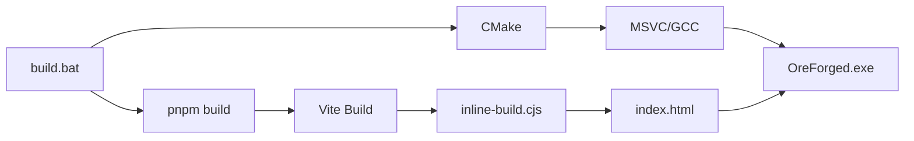

# Architecture Overview

The architecture centers on **backend-authoritative state management**. The C++ game engine owns all game logic (crafting, upgrades, progression), and the React UI is a view layer that renders this state.

## Backend-Authoritative State

All game state lives in C++:

```cpp
struct GameState {
    std::map<int, int> inventory;
    ProgressionState progression;
    PlayerState player;
    OreForged::World world;
};
```

The UI observes this state through **Facets** — reactive data bindings that update automatically when C++ pushes changes:

```typescript
// ui/src/game/data/Facets.ts
export const Facets = {
    PlayerStats: remoteFacet('player_stats', {...}),
    Inventory: remoteFacet('inventory', {...}),
    Progression: remoteFacet('progression', {...}),
};
```

Components import and observe these centralized Facets:

```tsx
import { Facets } from './game/data/Facets';

const stats = useFacetState(Facets.PlayerStats);
const inventory = useFacetState(Facets.Inventory);
```

When game state changes in C++, the backend pushes updates to the UI:

```cpp
void Game::CollectResource(int blockTypeId, int count) {
    m_state.inventory[blockTypeId] += count;
    m_state.progression.totalMined += count;
    
    PushInventory();      // Sync to UI
    PushPlayerStats();    // Sync to UI
    PushProgression();    // Sync to UI
}
```

This architecture eliminates state synchronization bugs — there's only one source of truth.

## Layer Breakdown

### 1. C++ Game Layer

**Files**:
- `src/main.cpp` - Entry point
- `src/Game.h` / `src/Game.cpp` - Game logic
- `CMakeLists.txt` - Build configuration

**Responsibilities**:
- Game loop (60 TPS)
- State management (`GameState`)
- Physics/logic updates
- Data binding to UI

**Key Classes**:

```cpp
class Game {
public:
    void Run();              // Start game loop + UI
    void Update();           // Called 60 times/second
    void UpdateFacet(...);   // Push state to UI
    
    // Game Actions
    void CollectResource(int blockTypeId, int count);
    void TryCraft(const std::string& recipeJson);
    void TryBuyUpgrade(const std::string& type);
    void TryRepair();
    void TryRegenerate(const std::string& seedStr, bool autoRandomize);
    void UnlockCrafting();
    void ResetProgression();
    
private:
    void GameLoop();         // Threaded loop
    void InitUI();           // Setup webview
    
    // State Sync
    void PushInventory();
    void PushPlayerStats();
    void PushProgression();
    
    GameState m_state;
    std::unique_ptr<WebviewWrapper> m_webview;
    std::thread m_gameLoopThread;
    std::atomic<bool> m_isRunning;
};
```

### 2. WebView Bridge Layer

**Technology**: [webview/webview](https://github.com/webview/webview)

**Responsibilities**:
- Embed Chromium in C++ application
- Provide JavaScript ↔ C++ communication
- Execute JavaScript from C++
- Bind C++ functions to JavaScript

**Key APIs**:

```cpp
// C++ → JavaScript
m_webview->w.eval("window.OreForged.updateFacet('id', value)");

// JavaScript → C++
m_webview->w.bind("updateState", [](std::string seq, std::string req, void*) {
    // Handle request
    m_webview->w.resolve(seq, 0, "OK");
}, nullptr);

// Game Action Bindings
m_webview->w.bind("craft", [&](std::string seq, std::string req, void*) {
    auto args = json::parse(req);
    TryCraft(args[0].get<std::string>());
    m_webview->w.resolve(seq, 0, "\"OK\"");
}, nullptr);

m_webview->w.bind("upgrade", [&](std::string seq, std::string req, void*) {
    auto args = json::parse(req);
    TryBuyUpgrade(args[0].get<std::string>());
    m_webview->w.resolve(seq, 0, "\"OK\"");
}, nullptr);

// More bindings: repairTool, regenerateWorld, unlockCrafting, resetProgression
```

### 3. JavaScript Bridge Layer

**Files**:
- `ui/src/engine/bridge.ts` - FacetManager & window bindings
- `ui/src/engine/hooks.ts` - React hooks
- `ui/src/engine/components.tsx` - Fast components

**Responsibilities**:
- Manage Facet registry
- Expose `window.OreForged` API
- Provide React hooks
- Implement fast components

**Key Classes**:

```typescript
class FacetManager {
    private facets = new Map<string, WritableFacet<any>>();
    
    getFacet<T>(id: string, initialValue: T): Facet<T>;
    updateFacet(id: string, value: any): void;
}
```

### 4. React UI Layer

**Files**:
- `ui/src/App.tsx` - Main application
- `ui/src/components/*.tsx` - UI components
- `ui/src/design/tokens.ts` - Design system
- `ui/src/layouts/GameLayout.tsx` - Layout & z-index management

**Responsibilities**:
- Render UI structure
- Manage layering (Game World vs HUD)

### 5. UI Layout Layer

**File**: `ui/src/layouts/GameLayout.tsx`

The specific layering system used to ensure UI sits correctly on top of the generic webview background.

```tsx
<GameLayout>
    {/* Z-Index 0: The 3D World */}
    <GameLayer zIndex={0}>
        <VoxelRenderer />
    </GameLayer>

    {/* Z-Index 10: The HUD (pointer-events: none by default) */}
    <HUDLayer>
        <TitleCard /> {/* pointer-events: auto */}
        <Inventory />
    </HUDLayer>
</GameLayout>
```

**Key Components**:

-   **GameLayer**: Wrapper for full-screen layers.
-   **HUDLayer**: High z-index layer that passes clicks through to the game by default (`pointer-events: none`), but allows children to catch clicks (`pointer-events: auto`).
6. facet.set(123)
   ↓
7. FastDiv.observe() → element.style.transform = ...
```

### UI → C++ (User Actions)

```
1. User clicks slider
   ↓
2. onChange handler
   ↓
3. updateGame("renderDistance", 16)
   ↓
4. window.updateState("renderDistance", 16)
   ↓
5. C++ binding receives JSON: ["renderDistance", 16]
   ↓
6. m_state.renderDistance = 16
```


## Threading Model

**Important**: 
- `webview.run()` blocks the main thread
- Game loop runs on separate thread at 60 TPS
- `dispatch()` queues work for main thread
- All UI updates must use `dispatch()`

## Build Process



**Steps**:
1. **UI Build**: `pnpm build` → Vite bundles React app
2. **Inline**: `inline-build.cjs` → Inlines JS into HTML (avoids CORS)
3. **C++ Build**: CMake → Compiles C++ code
4. **Link**: Executable includes `ui/index.html` path

## File Structure

```
Oreforged/
├── src/
│   ├── main.cpp           # Entry point
│   ├── Game.h             # Game class header
│   └── Game.cpp           # Game implementation
├── ui/
│   ├── src/
│   │   ├── App.tsx        # Main React app
│   │   ├── main.tsx       # React entry point
│   │   ├── components/    # UI components
│   │   ├── design/        # Design tokens
│   │   └── engine/        # OreUI core
│   │       ├── bridge.ts  # FacetManager
│   │       ├── hooks.ts   # React hooks
│   │       └── components.tsx  # Fast components
│   ├── index.html         # UI entry point
│   ├── inline-build.cjs   # Build script
│   └── package.json       # Dependencies
├── docs/                  # Documentation
├── build.bat              # Build script
└── CMakeLists.txt         # C++ build config
```

## Dependencies

### C++
| Operation | Frequency | Overhead |
|-----------|-----------|----------|
| Game Loop | 60 TPS | ~16ms budget |
| Facet Update | 60 FPS | <1ms (direct DOM) |
| React Render | On demand | Minimal (structure only) |
| C++ → JS | 60 FPS | ~0.1ms (eval) |
| JS → C++ | On event | ~0.5ms (JSON parse) |

## Security Considerations

### Content Security Policy

The webview runs local HTML with inline scripts:

```html
<!-- No external resources loaded -->
<script>/* Inlined JavaScript */</script>
```

### C++ Bindings

Only expose necessary functions:

```cpp
// ✅ Safe - Validated input
m_webview->w.bind("updateState", [](std::string seq, std::string req, void*) {
    auto args = json::parse(req);
    // Validate args before using
});

// ❌ Unsafe - Direct eval
m_webview->w.bind("eval", [](std::string seq, std::string req, void*) {
    eval(req); // Don't do this!
});
```

## Debugging

### C++ Side

```cpp
std::cout << "Tick: " << m_state.tickCount << std::endl;
```

### JavaScript Side

```typescript
console.log("Facet updated:", id, value);
// Forwarded to C++ console via logFromUI binding
```

### Chrome DevTools

Right-click webview → Inspect (if debug mode enabled)

## Next Steps

- [OreUI Guide](OREUI.md) - Learn the Facet pattern
- [Data Binding](DATA_BINDING.md) - Understand communication
- [Component Library](COMPONENTS.md) - Use components
