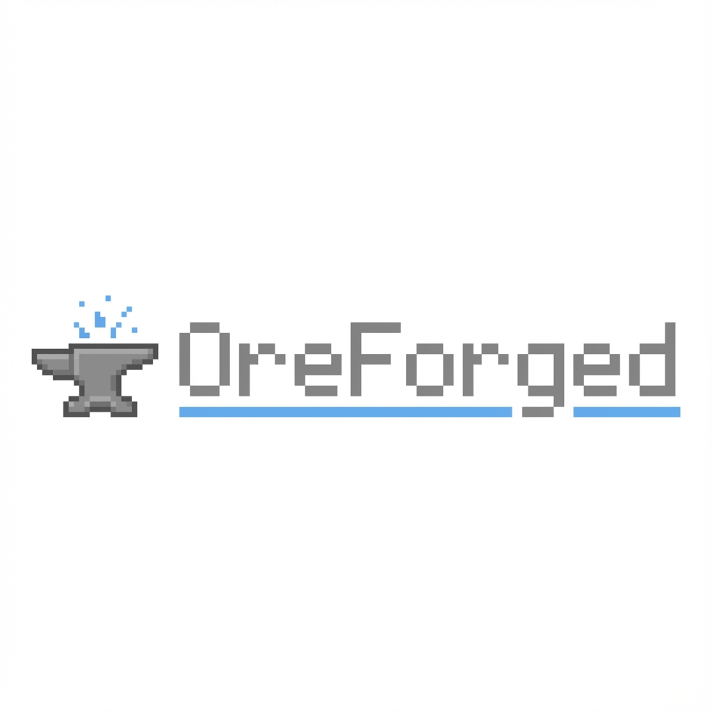

# OreForged Documentation

<p align="left">
  
</p>

Welcome to the OreForged documentation! This guide will help you understand and use the OreUI framework.

## Quick Links

-   **[Architecture](ARCHITECTURE.md)** - System design and structure
-   **[Data Binding](DATA_BINDING.md)** - C++ ↔ JavaScript communication
-   **[OreUI Guide](OREUI.md)** - Learn the Facet-based UI pattern
-   **[Component Library](COMPONENTS.md)** - Available UI components

## What is OreForged?

OreForged is a high-performance C++ game engine demo that showcases **OreUI** - a React-based UI library inspired by Mojang's Bedrock Edition architecture.

### Key Features

-   **Zero React Re-renders**: Direct DOM updates via Facets
-   **60 TPS Game Loop**: Smooth C++ game logic
-   **Two-Way Data Binding**: Efficient C++ ↔ JS communication
-   **Type-Safe**: Full TypeScript support

## Getting Started

### Installation

```bash
git clone https://github.com/yourusername/Oreforged.git
cd Oreforged
.\build.bat
```

### Your First Component

```tsx
import { remoteFacet } from "./engine/hooks";
import { FastDiv } from "./engine/components";
import { useFacetMap } from "@react-facet/core";

function HealthBar() {
	const health = remoteFacet<number>("player_health", 100);
	const width = useFacetMap((h) => `${h}%`, [], [health]);

	return <FastDiv style={{ width }} />;
}
```

## Core Concepts

### Facets

Facets are observable values that can be updated without triggering React re-renders.

```tsx
const tickCount = remoteFacet<number>("tick_count", 0);
```

### Remote Facets

Remote Facets connect to C++ game state:

```cpp
// C++
UpdateFacet("tick_count", std::to_string(m_state.tickCount));
```

```tsx
// React
const tickCount = remoteFacet<number>("tick_count", 0);
```

### Fast Components

Components that update the DOM directly:

```tsx
<FastDiv style={dynamicStyleFacet} />
```

## The OreUI Philosophy

### 1. Facets All The Way Down

Pass Facets through your component tree instead of unwrapping values early.

### 2. Direct DOM Updates

Use `fast-` components to bypass React reconciliation.

### 3. Minimal React Surface Area

Keep React for structure and events. Use Facets for dynamic data.

## Documentation Structure

```
docs/
├── README.md           # This file
├── OREUI.md           # Facet pattern guide
├── DATA_BINDING.md    # C++ ↔ JS communication
├── COMPONENTS.md      # Component library
└── ARCHITECTURE.md    # System design
```

## Examples

### Animated Element

```tsx
const tickCount = remoteFacet<number>("tick_count", 0);
const style = useFacetMap(
	(tick) => ({
		transform: `translateX(${tick % 300}px) rotate(${tick * 5}deg)`,
	}),
	[],
	[tickCount]
);

<FastDiv style={style}>Animated!</FastDiv>;
```

### Form with Validation

```tsx
function LoginForm() {
	const [username, setUsername] = useState("");

	const handleSubmit = () => {
		updateGame("login", { username });
	};

	return (
		<Panel>
			<Input
				value={username}
				onChange={(e) => setUsername(e.target.value)}
			/>
			<Button onClick={handleSubmit}>Login</Button>
		</Panel>
	);
}
```

## Contributing

See [CONTRIBUTING.md](../CONTRIBUTING.md) for guidelines.

## License

MIT License - see [LICENSE](../LICENSE)

---

**Need help?** Open an issue or discussion on GitHub!
